# LedgerLens — Bank Statement Analyzer (Credit Risk Lens) · Proof of Concept

LedgerLens ingests raw bank statements (digital PDF, scanned PDF, images, Excel, CSV, text), extracts every transaction, classifies it, validates the data and produces a structured credit-risk summary: a 0–1000 score, a rating band and a decision recommendation.

It comes in two forms that share **one engine** (`cli/engine.js`):

| | Web app | Command line |
|---|---|---|
| What | Interactive UI: upload, pipeline view, transactions, review queue, risk summary, activity log, taxonomy | Same pipeline, writes the JSON output |
| Runs | In the browser (hosted canvas link) — all processing on the user's device | Locally on Node 18+ |
| OCR | Tesseract (WASM) in the browser | tesseract.js + poppler `pdftoppm` for scanned PDFs |
| LLM | Off — the browser holds no API key, so it runs rules-only | **Claude** (`claude-opus-5-5`) via the Anthropic SDK when `ANTHROPIC_API_KEY` is set |

---

## 1. Setup

### Web app
Open the LedgerLens link (shared separately). Nothing to install. Upload a statement or click one of the three built-in samples. Web source: `web/LedgerLens.dc.html`.

### Command line (runs locally)
```bash
cd cli
npm install                      # pdfjs-dist, tesseract.js, English OCR model, xlsx
# for scanned PDFs also install poppler:  sudo apt install poppler-utils   |   brew install poppler

node cli.js ../test-statements/01_single_month_digital.pdf -o out.json
node cli.js ../test-statements/02_multi_month_multi_account.pdf -o out.json
node cli.js ../test-statements/03a_scanned_page1.png -o out.json
node cli.js ../test-statements/03b_scanned_statement.pdf -o out.json
node cli.js locked.pdf --password <pw> -o out.json
node cli.js --sample flags            # built-in samples: flags | clean | jumbled
node cli.js a.pdf b.pdf c.png         # several files / accounts in one upload

# LLM step (Claude). Without a key the pipeline runs rules-only and says so.
export ANTHROPIC_API_KEY=sk-ant-...
node cli.js ../test-statements/05_amount_drcr_column.csv -o out.json   # layout the rules cannot read → model reads it
node cli.js statement.pdf --llm all -o out.json                         # model reads every batch, rules validate
node cli.js statement.pdf --llm off                                     # rules only
node cli.js statement.pdf --model claude-sonnet-5-5                     # another model (default claude-opus-5-5)

npm test                              # 10 tests; LLM path uses a stand-in model, no key needed
```
Exit codes: `0` success · `2` password needed or wrong · `3` pipeline stopped by validation (e.g. jumbled pages, no rows found).

---

## 2. Architecture

```mermaid
flowchart LR
  A[Upload<br/>PDF · scan · PNG/JPG · XLSX · CSV · TXT] --> B[1 Convert<br/>pdf.js text layer · OCR for scans · Excel→CSV]
  B --> C[2 Validate page order<br/>Page X of Y per file · date continuity · missing pages]
  C --> D[3 Batch extraction<br/>3 pages / batch · rules, or Claude for<br/>batches the rules cannot read · inheritance]
  D --> E[Data cleaning<br/>duplicates · bad dates · bad amounts]
  E --> F[4 Enrich<br/>counterparty · channel · attributes · aliases · IFSC→bank]
  F --> G[5 Classify<br/>RULE → Claude for uncertain rows → MANUAL]
  G --> H[Smart review<br/>high-impact items only · grouped]
  H --> I[6 Score<br/>6 components → 0–1000 · band · decision]
  I --> J[22 data validation checks]
  J --> K[JSON export · UI · Activity log]
```



| Stage | What it does |
|---|---|
| **Convert** | Digital PDF: pdf.js text layer, words re-joined left→right per line. Scanned page / image: rendered and OCR'd (Tesseract, English, SIMD + parallel workers in the browser). Excel: each sheet → CSV text, dates → DD/MM/YYYY. Password PDFs: password asked, used once, never stored. |
| **Validate order** | `Page X of Y` footers checked **per file** (each upload restarts at page 1). Detects *jumbled* and *missing* pages. Without footers, dates must not run backwards between pages. Stops with a clear error. |
| **Batch extraction** | Pages processed **3 per batch** (the unit a production LLM call would take). Header fields read per page: bank, account / card no., holder, type, currency, opening / closing balance, statement period. Pages without a header **inherit** them from the previous page / batch (and bank backwards from the next account); every inheritance is logged. Rows: table with `|`, CSV, or plain PDF text (date · [value date] · narration · amounts · balance). Single-amount rows get debit/credit from the balance movement. |
| **LLM extraction** | For each 3-page batch whose pages carry dates but no rows the rules can parse (`--llm auto`, default) — or every batch (`--llm all`) — the page text plus metadata carried from earlier batches goes to Claude with a JSON schema (structured outputs): per page, the header fields printed on *that* page and every transaction row. The answer is turned back into the engine's own page format, so metadata inheritance, debit/credit resolution and **all 22 checks run on model output exactly as on rule output** — a misread amount breaks the balance chain and forces REFER. A failed call is logged and the batch keeps the rule reading. In `all` mode, row-count disagreements between model and rules are logged. |
| **Data cleaning** | Exact duplicate rows across files (overlapping statements) removed; impossible dates and rows without an amount dropped — all logged. |
| **Enrich** | **Counterparty is mandatory**: parsed from narration formats of HDFC, ICICI, SBI, Axis, Kotak + generic UPI/NEFT/RTGS/IMPS/NACH/ECS/BBPS/card/ATM/cheque patterns, with a confidence score; never blank (falls back to `UNIDENTIFIED` and is flagged). 41 merchant aliases (e.g. `AMZN`, `AMAZON PAY INDIA PRIVA` → AMAZON). Truncated legal names grouped (`ACME TECH PRIVATE LIMI` = `ACME TECH PVT LTD`). Attributes: loan a/c, card last 4, platform (Stripe, Apple Pay…), counterparty a/c, UPI ID, IFSC + counterparty bank (65 bank codes), UTR/RRN, cheque no., foreign amount/currency. |
| **Classify** | Level 1 CREDIT/DEBIT; Level 2 from a built-in taxonomy of 38 categories, overridable/extendable by CSV. Order: user rules → structural rules (bounce, reversal, own-account transfer, card bill, refund, loan disbursal, salary, EMI with loan no., NACH to lender) → narration keywords (so *Tuition fee* → EDUCATION even when paid to a person) → P2P for individuals → lexical fallback → OTHER. **Then every uncertain row** (category or counterparty below threshold, OTHER, lexical guess) is sent to Claude in chunks of 40 with the active taxonomy and the rules' guess; the model returns counterparty + category + confidence + reason. A label is accepted only if its code exists in the taxonomy with the row's Level 1; confidence is capped at 95%; rows still under threshold go to review. Every row stores `classification_confidence` and `method` (RULE / LLM / MANUAL) — `LLM` only ever means a real model answered. |
| **Smart review** | Rows under the threshold (default 70%) are flagged, but only **high-impact** ones are queued: ≥ ₹10k (or 5% of income), credits ≥ ₹5k (possible income), monthly recurring (possible EMI/rent), loan-related, possible bounce. Low-impact one-offs are auto-accepted and marked. Similar rows are grouped; one decision applies to all; decisions can be saved as rules for future statements. |
| **Score** | Six weighted components → composite 0–1000, band and decision with reasons (see §4). |

**Key files:** `cli/engine.js` (engine — identical to the web logic), `cli/cli.js` (Node adapters), `web/LedgerLens.dc.html` (UI), `tools/` (test-statement generators).

---

## 3. Key design decisions

1. **Rules first, model second, human last.** Indian narrations are semi-structured (UPI/NEFT/NACH formats); deterministic rules are fast, free, explainable and auditable for a credit decision. Claude handles what the rules cannot: unknown layouts (extraction) and uncertain rows (classification). Humans only see what can change the decision.
2. **The model is never trusted blindly.** Extraction output re-enters the rule pipeline and must pass the balance-arithmetic checks; classification output must name a taxonomy code with the right Level 1. Schema-validated JSON (structured outputs), effort `low` (a well-specified extraction task), server-side refusal fallback on. Any API error falls back to rules for that batch/chunk — the run never dies because of the model.
3. **Confidence + method on every field that matters.** Counterparty and category both carry a confidence; credit officers can see *how* each label was produced.
4. **Integrity over coverage.** Balance arithmetic is checked on every row and opening + movements = closing per account. A broken balance **forces REFER** regardless of score — an OCR misread or an edited PDF must never silently produce an APPROVE.
5. **Decision = band + hard overrides.** The band sets the base decision; policy rules override it (FOIR > 65% → DECLINE; **under 3 months of history**, tampering, structuring, circular flows → REFER; any EMI bounce → at most APPROVE WITH CONDITIONS). Reasons are always listed.
6. **Not every credit is income.** Income = SALARY, BUSINESS_INCOME, INTEREST, RENTAL_INCOME only. P2P receipts, refunds, reversals, loan disbursals, own-account transfers, card payments and cash deposits are excluded.
7. **Review effort is a product constraint.** A queue nobody can finish is useless, hence materiality triage, grouping and learnable rules.
8. **Privacy by design.** Web app processes everything on the user's device; nothing is uploaded; passwords are never stored or logged. The CLI sends statement text to the Anthropic API only when a key is configured; `--llm off` keeps it fully local.
9. **One engine, two shells.** The same code powers the UI and the CLI, so the JSON from the CLI equals what the UI shows.

---

## 4. Credit risk model

| Component (weight) | Metrics implemented | Scoring (0–100) |
|---|---|---|
| **Income Stability (25%)** | Monthly income by category, regularity (CV of primary source), source diversity, growth first→last month, level | 40% regularity · 20% diversity · 20% growth · 20% level (₹1L/month = 100). Regularity needs ≥ 2 months and growth ≥ 3 months; with less they score a neutral 50, not 100 |
| **Debt Service (20%)** | EMIs per loan (by loan a/c or lender), monthly EMI total, **FOIR**, EMI bounce rate, on-time rate | 50% FOIR (≤30% = 100 … >60% = 20) · 25% bounce rate · 25% on-time |
| **Liquidity (15%)** | Average / minimum end-of-day balance (all deposit accounts combined), negative-balance days | 50% avg EOD ÷ income · 30% min EOD ÷ EMI · 20% negative days |
| **Banking Behaviour (10%)** | Bounce count, bounce charges, penalty fees, total charges, overdraft days | 100 − 25/bounce − 10/penalty − 5/overdraft day − charges |
| **Fraud Indicators (15%)** | Balance arithmetic breaks, circular transactions, overnight pass-through, structuring | 100 − 40 (integrity) − 20/circular − 15/overnight − 35/structuring |
| **Expense Management (15%)** | Essential vs discretionary, fixed vs variable, month-on-month spend trend, savings rate after EMI | 40% discretionary share · 30% trend · 30% savings rate |

Composite = Σ(score × weight) × 10. Bands: **Excellent ≥ 800 · Good 700–799 · Fair 600–699 · Below Average 500–599 · Poor < 500** → APPROVE · APPROVE · APPROVE WITH CONDITIONS · REFER · DECLINE (before overrides).

**Minimum history rule.** A decision needs at least **3 calendar months and 75+ days** between the first and last transaction. With less, the score is still computed (and shown) but the decision is forced to **REFER** with the reason *"Only N month(s) / D days of history — at least 3 months are required to decide; request more statements"* (a DECLINE stays DECLINE). The JSON carries `period.days_covered`, `period.minimum_months` and `period.sufficient_history`.

---

## 5. Data validation — 22 checks

| # | Group | Check | On failure |
|---|---|---|---|
| 1 | On upload | Password-protected PDF | Paused until correct password |
| 2 | On upload | Empty file | Stops |
| 3 | On upload | Scanned PDF / image detected | Sent to OCR |
| 4 | On upload | OCR engine available (workers, WASM, scripts, memory) | Clear error naming the blocker |
| 5 | On upload | Transactions found | Stops |
| 6 | File | Type, ≤ 25 MB, ≤ 300 pages | Stops |
| 7 | File | Duplicate files in upload | Second copy skipped |
| 8 | File | Readable text on every page | Warning |
| 9 | File | OCR confidence ≥ 60% per page | Warning |
| 10 | Structure | Page order (jumbled / missing pages, per file; dates if no footers) | Stops |
| 11 | Structure | Account details present | Warning + fill-in form |
| 12 | Structure | Rows inside the stated statement period | Warning |
| 13 | Structure | Data covers the full stated period | Warning |
| 14 | Integrity | Running balance arithmetic on every row | **Fail → REFER** |
| 15 | Integrity | Opening + transactions = closing | **Fail** |
| 16 | Integrity | Duplicate transactions across files | Removed |
| 17 | Integrity | Valid dates (2000 … today) | Dropped |
| 18 | Integrity | Valid amounts (exactly one of debit/credit) | Dropped / flagged |
| 19 | Completeness | No gap > 35 days | Warning |
| 20 | Completeness | ≥ 3 months (75+ days) and ≥ 20 transactions | < 3 months: **decision → REFER**; < 20 txns: warning |
| 21 | Consistency | Single currency | Warning |
| 22 | Consistency | All accounts belong to the same applicant | Warning |

All 22 results are included in the JSON output (`data_validation`).

---

## 6. Test data & results

All test statements are **synthetic** (generated with ReportLab / Pillow by the scripts in `tools/`) using realistic Indian narration formats; no real customer data is used.

| File | What it tests | Pages / accounts / txns | Result | Review items | Validation (pass / warn / fail / n.a.) |
|---|---|---|---|---|---|
| `01_single_month_digital.pdf` | Single-month digital PDF, plain-text columns, mixed HDFC/SBI/ICICI/Axis/Kotak narrations, page 2 without header | 2 / 1 / 32 | **901 · Excellent · REFER** (only 1 month of history) | 0 | 17 / 1 / 0 / 4 |
| `02_multi_month_multi_account.pdf` | Jan–Mar 2025, individual + joint + credit card, metadata inheritance across 4 batches, EMI bounce, structuring, circular flow, late fee, FX card spend | 12 / 3 / 120 | **777 · Good · REFER** (structuring + circular overrides) | 5 (3 groups) | 18 / 0 / 0 / 4 |
| `03a_scanned_page1.png` | Image (photo-like noise, blur, 0.6° skew) → OCR | 1 / 1 / 18 | **894 · Excellent · REFER** (17 days of history) | 0 | 19 / 2 / 0 / 1 |
| `03b_scanned_statement.pdf` | Image-only (scanned) PDF → render → OCR | 2 / 1 / 32 | **841 · Excellent · REFER** (CLI: one OCR digit error breaks the balance chain; plus 1 month of history) | 0 | 18 / 1 / 2 / 1 |
| `04_csv_export_jan2025.csv` | Bank CSV export with header rows, quoted amounts | 1 / 1 / 32 | **901 · Excellent · REFER** (only 1 month of history) | 0 | 15 / 1 / 0 / 6 |
| `05_amount_drcr_column.csv` | Kotak-style layout: one **Amount** column + **Dr/Cr** marker, Jan–Mar 2025 | 1 / 1 / 24 | Rules only: **stops** ("No transaction rows were recognised"). With the LLM step: batch read by the model, all balance checks pass (verified in `npm test` with a stand-in model) | — | — |
| built-in `jumbled` sample | Pages 4 and 5 swapped | — | **Stops:** "Pages appear jumbled: position 4 carries Page 5 of 12" | — | — |

Sample outputs (transactions + credit risk summary + validation) are in `sample-output/*.output.json`, all produced by the CLI with the LLM step off (rules only). Schema: `ledgerlens.bsa.v1` — `run`, `accounts`, `data_validation`, `transactions[]`, `credit_risk_summary{composite_score, rating_band, decision, decision_reasons, components[], metrics{income_stability, debt_service, liquidity, banking_behaviour, fraud_indicators, expense_management}}`.

### Limitations observed with the test data
- **OCR digit errors are real and are caught.** Running the scanned PDF through the CLI (poppler 200 dpi render) misread `1,532.40` as `1,632.40` on one row. Checks 14 and 15 failed and the decision was forced to **REFER** (906) instead of APPROVE — the intended safety behaviour. The browser render of the same file read every row correctly (966). At 300 dpi the CLI lost 5 rows, so 200 dpi is the default.
- **OCR punctuation noise** (`UP!`, `NWD:-`, stray `.`/`’` between columns) is cleaned before parsing; a speck between amount columns used to swallow an amount and is now handled.
- **Numbers inside narrations** (`INTL TXN/USD 24.99/…`) were initially read as an amount; the parser now only takes amounts at the end of the line.
- **Mandate debits without "EMI"** (`ACH D- TATA CAPITAL LTD-…`) were initially OTHER and missed in FOIR; a rule now treats NACH/ACH debits to lenders as EMI (0.82).
- A **single scanned page** of a two-page statement correctly warns *"data 01/01–17/01 vs stated 01/01–31/01"*.

---

## 7. Assumptions

| Area | Assumption | Why |
|---|---|---|
| Geography | Indian statements, INR, DD/MM dates, Indian digit grouping (1,42,500.00) | Target market of the platform |
| Dates | MM/DD/YYYY not supported | Ambiguous with DD/MM; Indian banks use DD/MM |
| Income | Only SALARY, BUSINESS_INCOME, INTEREST, RENTAL_INCOME count | Brief: not every credit is income |
| Salary | Keyword SALARY/PAYROLL/SAL from a non-person, or a company credit recurring ≥ 2 months | Common employer-credit patterns |
| EMI | Debit with a loan a/c no. + EMI/ACH/NACH, or NACH/ACH to a lender | Banks rarely print "EMI" on every mandate |
| FOIR | Sum of latest EMI per identified loan ÷ average monthly income (rent excluded) | Standard lender definition of fixed obligations |
| Overdraft usage | Days where any deposit account's end-of-day balance < 0 | No OD limit is printed on statements |
| Overnight transactions | ≥ ₹50k credit followed by ≥ 90% debited within 1 day (pass-through) | Statements rarely show timestamps |
| Circular transactions | Credit and debit of ≈ same amount (±2%) with the same counterparty within 3 days | Round-tripping pattern |
| Structuring | ≥ 3 cash deposits of ₹40–50k within 30 days | Just under the ₹50k PAN-reporting threshold |
| Expenses | EMIs, investments, own transfers and card bill payments excluded from spend | Avoids double counting and keeps debt separate |
| Joint / card accounts | Belong to the same customer; card balance = outstanding (debit increases it) | Typical multi-account upload |
| Minimum history | 3 calendar months and ≥ 75 days first→last transaction, else REFER | Regularity and trend can't be judged from one salary credit; 75 days tolerates statements whose first/last rows don't fall on month boundaries |
| LLM model | `claude-opus-5-5`, effort `low`, structured outputs; override with `--model` | Extraction/labelling is well-specified; low effort keeps cost and latency down. Change after measuring on an eval set |
| Review threshold | 70% default, adjustable; smart review on by default | Balance between accuracy and reviewer effort |
| Score weights | As given in the brief; component formulas and cut-offs are illustrative and should be calibrated on historical defaults | No outcome data in a PoC |

---

## 8. Known limitations

1. **LLM step is CLI-only, and not yet measured.** The web app has no API key and runs rules-only. The Claude integration is covered by tests against a stand-in model (plumbing, validation of answers, fallback on errors), but there is no labelled set yet to measure the model's extraction or labelling accuracy versus the rules, nor its cost per statement.
2. **Narration formats.** Built from public explainers and common patterns; banks vary by core system. Unknown formats fall to review and can be taught via counterparty rules (stored per browser).
3. **OCR.** English only; quality drops on blurred, skewed or low-resolution scans. Integrity checks catch digit errors but cannot fix them.
4. **Cheques** rarely print the counterparty; these stay at 55% confidence.
5. **No external data:** no MCC codes for card merchants, no UPI-ID name lookup, IFSC resolves to bank (not branch), no bureau cross-check of EMIs.
6. **Persistence:** rules, activity log and run history are kept in the browser's local storage only; no multi-user backend.
7. **Scoring** is rules-based and uncalibrated (see Assumptions).

---

## 9. Next steps (production)
1. Build a labelled evaluation set (real redacted statements) to measure rules vs. model accuracy per field, then tune `--llm auto` triggers, effort and model choice; batch API for non-urgent runs. Serve the LLM step from the backend so the web app can use it without exposing a key.
2. Backend service (API + queue + database) for shared rules, audit trail and multi-user review.
3. RBI **Account Aggregator** ingestion (structured data, no OCR).
4. Server-side OCR (cloud) for poor scans; bureau and MCC enrichment.
5. Calibrate weights and cut-offs on historical loan performance.

See `DEMO_SCRIPT.md` for the walkthrough recording.
